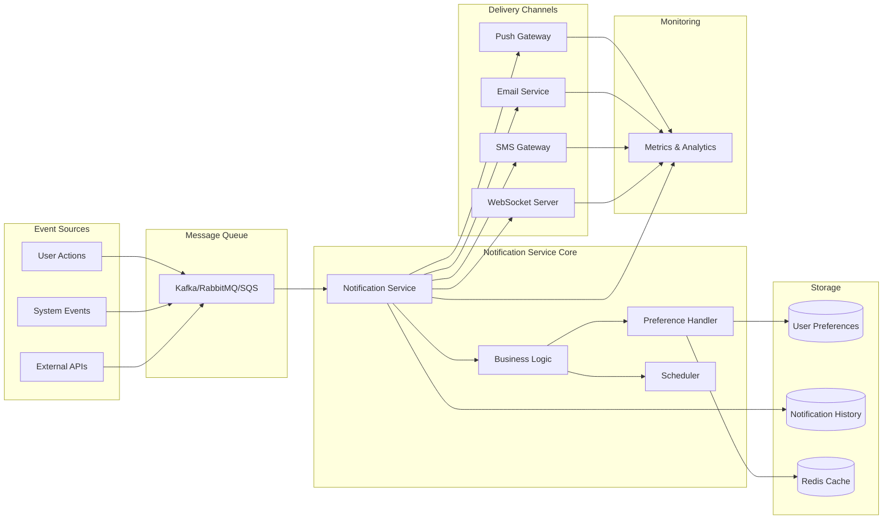
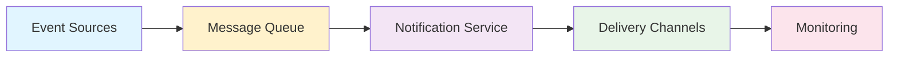

# Notification Service System Design

## Overview (What the system does)
Event-driven architecture for multi-channel notifications (push, SMS, email, in-app) with scalability, fault tolerance, and user preference handling.

## Functional Requirements (What the system must do)
- **Multi-channel support**: Push, email, SMS, in-app
- **Event-driven triggers**: User/system/external events
- **Real-time delivery**: Sub-second for critical alerts
- **User preferences**: Opt-in/out, quiet hours, channel priority
- **Localization**: Language and timezone adaptation
- **Tracking & analytics**: Delivery logs and engagement metrics

## Non-Functional Requirements
- **Scalability**: Millions of concurrent notifications
- **Low latency**: Sub-second delivery for critical events
- **High availability**: 99.9%+ uptime, no single point of failure
- **Fault tolerance**: Automatic retries, fallback mechanisms
- **Security & compliance**: GDPR, HIPAA, encryption, data privacy
- **Extensibility**: Easy integration with third-party providers

## High-Level Architecture (System components)

### Core Components
1. **Event Producers**: User actions, system events, external APIs
2. **Message Queue**: Kafka, RabbitMQ, SQS (decoupling, durability)
3. **Notification Service Core**: Event processors, business logic, preference handler, scheduler
4. **Storage Layers**: User preferences (SQL/NoSQL), notification history, Redis cache
5. **Delivery Channels**: APNs/FCM (push), SendGrid/SES (email), Twilio (SMS), WebSocket (in-app)
6. **Monitoring & Analytics**: Metrics, feedback loops, compliance logging

## Event Flow (Message journey)

## User Preferences & Personalization (Customization features)
- **Preference management**: Opt-in/out, granular categories, quiet hours, frequency caps
- **Personalization**: Localization, channel priority, contextual content, ML-driven timing
- **Storage**: NoSQL (flexible schema), Redis cache, encrypted PII handling

## Delivery Mechanisms (Channel options)
| Channel | Use Cases | Challenges |
|---------|-----------|------------|
| **Push** | Chat, updates, alerts | Token management, rate limits |
| **Email** | Receipts, confirmations, marketing | Spam filters, bounces, formatting |
| **SMS** | OTPs, banking, time-sensitive | Cost, carrier regulations, failures |
| **In-app/WebSocket** | Real-time chat, dashboards | Persistent connections, scaling |

**Fallback strategy**: If push fails → SMS; if email delayed → in-app alert

## Scalability & Performance (Handling growth)
- **Horizontal scaling**: Microservices, load balancers, stateless workers
- **Throughput**: Kafka partitions, parallel processing, backpressure handling
- **Caching**: Redis for user preferences, rate limiting per user
- **Priority queues**: Critical alerts (fraud, OTP) bypass normal flow
- **Latency**: Sub-second for real-time, batched for scheduled updates

## Fault Tolerance & Reliability (Resilience features)
- **Redundancy**: Multi-region deployment, replicated message brokers
- **Retry strategies**: Exponential backoff, fallback channels
- **Dead-letter queues**: Failed messages for inspection and fixing
- **Health checks**: Heartbeat monitoring, circuit breakers
- **Target**: 99.999% uptime (five-nines)

## Analytics & Feedback Loops (Continuous improvement)
### Metrics
- **Delivery**: Success rate, failure rate, latency
- **Engagement**: Open rate, CTR, opt-out rate
- **User feedback**: Report spam, ML suppression

### Optimization
- **A/B testing**: Format, timing, channel
- **Compliance**: GDPR/HIPAA audit logs, data deletion support

## Security (Protection measures)
- **Encryption**: TLS in transit, AES at rest
- **Auth**: API keys/OAuth, RBAC for access control
- **Payload sanitization**: Prevent injection attacks
- **Privacy**: No PII in notifications, consent management
- **Abuse prevention**: Rate limiting, anomaly detection

## Testing & Monitoring (Quality assurance)
- **Testing**: Unit, integration, load, chaos testing
- **Monitoring**: Real-time dashboards (Grafana), alerting on anomalies
- **Observability**: Distributed tracing, detailed lifecycle logs

## Future Trends (What's next)
- **AI personalization**: Predictive timing and channel selection
- **Cross-channel orchestration**: Seamless switching, no duplicates
- **Edge computing**: Latency reduction for real-time alerts
- **Privacy-first**: Minimal data retention, transparent consent
- **Immersive notifications**: Voice assistants, AR/VR environments

## Key Takeaways (Essential points)
- Design for **scale** (billions/day) and **reliability** (five-nines)
- Respect **user preferences** to avoid notification fatigue
- Implement **multi-layer fallback** for maximum uptime
- **Monitor everything** - failures are user-visible instantly
- **Security and compliance** are non-negotiable for sensitive alerts
