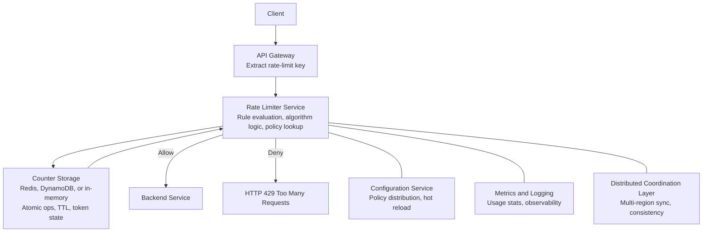
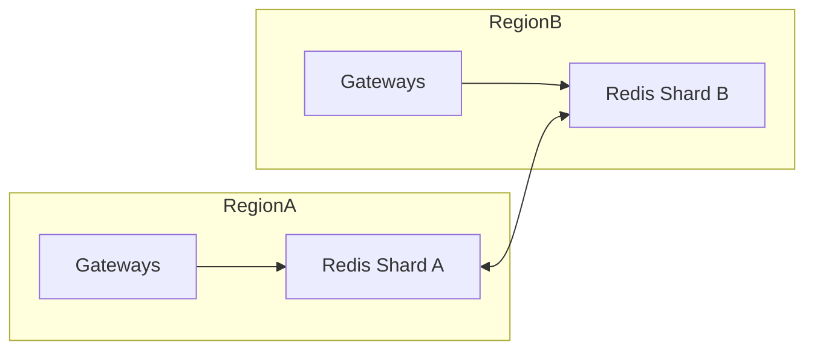
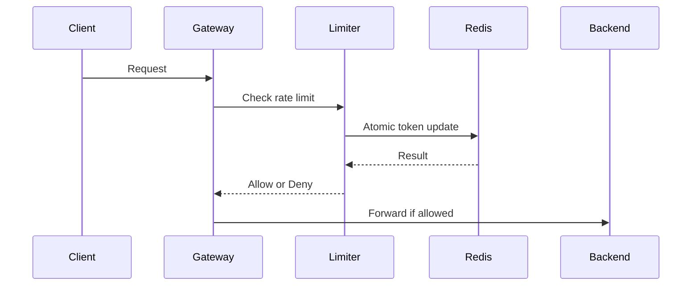

# **RATE LIMITER SYSTEM DESIGN**

## **1. Functional Requirements (What the rate limiter must do)**

Enforce quotas (per IP, user, API key, service, tenant, endpoint).  
Support multiple policies (100/min, 10/sec, 1,000/hour, 5 login attempts/10 min).  
Support algorithms (token bucket, leaky bucket, fixed window, sliding window, hybrid).  
Return standardized HTTP 429 responses with retry‑after.  
Provide usage visibility (current usage, remaining quota, reset time, history).  
Maintain consistent enforcement across regions.  
Allow real‑time policy updates without restarts.

---

## **2. Non‑Functional Requirements (How the system must behave)**

Low latency (few ms overhead).  
High availability (no single point of failure).  
Horizontal scalability (millions of RPS and unique keys).  
Fairness across tenants and users.  
Distributed consistency across nodes.  
Fault tolerance (fail‑open or fail‑closed depending on endpoint).  
Efficient storage with TTL‑based cleanup.

---

## **3. Edge Case Considerations (Special conditions to handle)**

Window‑boundary bursts; clock drift; bot attacks; multi‑AZ traffic; aggressive retries after 429.

---

## **4. High‑Level Architecture (How the system is structured)**

Flow: client → gateway → rate limiter → backend.  
Components: API gateway, rate limiter service, configuration service, counter storage (Redis/DynamoDB), metrics/logging, optional coordination layer.  
Variants: in‑process, centralized service, Redis‑based distributed limiter, edge/CDN enforcement.  
Workflow: extract key → check counters → apply algorithm → allow/deny → log/metrics.

---

## **5. Algorithms (How limits are enforced)**

Fixed window (simple, bursty).  
Sliding window log (accurate, heavy).  
Sliding window counter (balanced).  
Token bucket (industry standard, burst‑friendly).   
Leaky bucket (smooths traffic).  
Choice depends on accuracy, burst tolerance, latency, and storage cost.

---

## **6. State & Storage (Where counters live)**

In‑memory (fast, inconsistent).  
Redis (atomic ops, low latency).  
NoSQL (global consistency, higher latency).  
Data structures: integers, sorted sets, ring buffers, token counters + timestamps.  
Memory management: TTLs, auto‑delete, log pruning.  
Atomicity via Lua scripts or conditional updates.

---

## **7. Distributed Enforcement (How to stay correct across nodes/regions)**

Local limits fail due to partial visibility.  
Centralized Redis cluster: atomic, low latency, hotspot‑prone.  
Sharding via consistent hashing: spreads load.  
Multi‑region: handle replication lag, divergence, partitions; use regional quotas, CRDTs, or token preallocation.  
Consistency models: strong, eventual, bounded staleness.  
Failure modes: fail‑open vs fail‑closed.

---

## **8. Enforcement Placement (Where limits are applied)**

Client‑side (rare).  
Edge gateways (Cloudflare/AWS).  
Reverse proxies (NGINX/Envoy).  
Service mesh sidecars (Istio/Envoy).  
Centralized microservice.  
Policies distributed via hot‑reloading.

---

## **9. Scaling & Resilience (How to handle massive traffic)**

Scale gateways, services, and Redis clusters horizontally.  
Avoid hot keys; use caching and pre‑warming.  
Smooth bursts; apply backoff and circuit breakers.  
Plan for Redis outages, partitions, node crashes.  
Monitor latency, errors, key distribution, refill behavior, cross‑region sync lag.

---
## **10. End‑to‑End Example (Production pattern)**

Token bucket + Redis with atomic Lua scripts.  
Multi‑region token distribution.  
Tenant‑specific policies.  
Dashboards and logs for debugging.  

---
