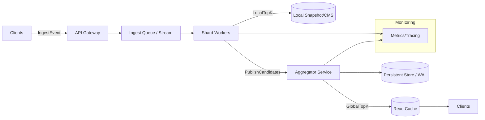
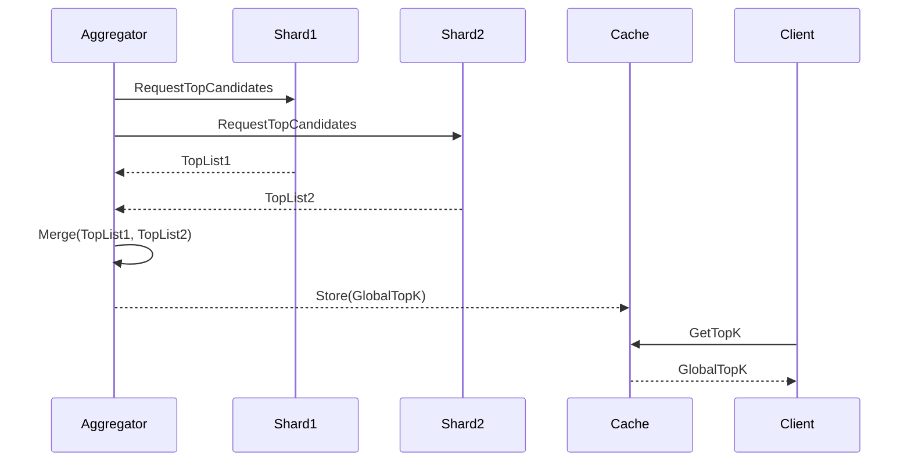

# Top-K System Design (Compact summary for printing)

## Problem (What we're solving)
- Maintain top-K items (by score/count) over a large, high-throughput dataset in near real-time.

## Goals (Success criteria)
- Accuracy vs latency tunable; scalable horizontally; bounded memory; high availability.

## Non-Functional Requirements (How the system must behave)
- Throughput: support high event ingestion rate.
- Latency: return top-K within acceptable staleness window.
- Availability: survive node failures with minimal disruption.
- Cost: memory/time trade-offs adjustable.

## API (Client surface)
- IngestEvent(item_id, delta) - submit updates.
- GetTopK(K, scope, time_window) - query current top-K.
- Admin: SetRetention, SetShards, Health/metrics endpoints.

## Data Model (Key entities)
- Event: {item_id, delta, timestamp, optional_key}
- PartialTopK (per-shard): bounded structure holding top candidates.
- GlobalTopK: aggregated merged result returned to clients.

## Core Ideas (High-level approach)
- Shard by item_id hash to distribute updates.
- Each shard maintains an approximate/high-confidence local top-K (sketch + heap).
- Periodic or on-demand aggregator merges shard results to produce GlobalTopK.

## Local Shard Implementation (Memory-sensitive)
- Use Count-Min Sketch (CMS) or Space-Saving algorithm for frequency estimation.
- Maintain a fixed-size min-heap of candidate top-K to track heavy hitters.
- Evict low-score entries; keep CMS to estimate unseen items.

## Merge Strategy (Correctness & performance)
- Pull local top lists and estimated counts -> merge by estimated count -> re-rank.
- Optionally, for exactness, re-check top M candidates against persistent store or replay logs.

## Consistency Model (Behavior guarantees)
- Eventual: global top-K converges after aggregation.
- Configurable staleness: tune ingestion buffering and aggregation interval.

## Fault Tolerance (How failures are handled)
- Shard state persist to local snapshots or replicated KV store.
- On node failure: re-hash affected keys to other shards; rebuild from WAL/snapshots.

## Scaling (How to grow capacity)
- Increase shard count (reshard with minimal downtime using consistent hashing).
- Add aggregator replicas behind a read cache for heavy read load.

## Optimizations (Performance knobs)
- Sampling: reduce ingestion volume for low-impact items.
- Hierarchical aggregation: multi-level merge (local -> regional -> global).
- Adaptive K: track larger local candidate sets, but only merge top subset.

## Monitoring & Metrics (What to measure)
- Ingest QPS, per-shard CPU/memory, queue lengths.
- Top-K query latency, staleness (time since last merge), merge duration.
- Sketch error bounds, eviction rate, checksum mismatches.

## Capacity Planning (Rules of thumb)
- Memory per shard ≈ (#candidates * size_per_entry) + CMS size.
- CMS width/depth tuned for acceptable error: error ≈ e / width.

## Cost / Trade-offs (Short list)
- Exactness vs memory: exact counts need more state and I/O.
- Latency vs freshness: more frequent merges => fresher results, higher CPU.
- Read scalability vs aggregation frequency: cache aggressively.

## Security & Privacy (Notes)
- Authenticate API calls; rate-limit clients.
- If items are sensitive, avoid storing raw identifiers in public caches; hash or encrypt.

## When to use this design (Applicability)
- Leaderboards, trending topics, hot items, analytics dashboards.

## Quick merge pseudocode (How to combine shard results)
```text
inputs: per_shard_lists[ ] (each sorted desc by est_count)
heap = empty min-heap size K
for each list in per_shard_lists:
  for (item, est) in list:
    if item in heap: update count
    else if heap.size < K: push(item, est)
    else if est > heap.min.est: pop min; push(item, est)
return sorted_desc(heap)
```

## Logical Architecture (Components & flow)


## Merge Sequence (How aggregator collects & merges)


## Quick checklist before production (One-liner items)
- Define K and acceptable staleness.
- Choose sketch/algorithm (CMS, Space-Saving, exact counters).
- Plan shard key and reshard path.
- Implement WAL + periodic snapshotting.
- Build monitoring, alerting, and recovery playbooks.


