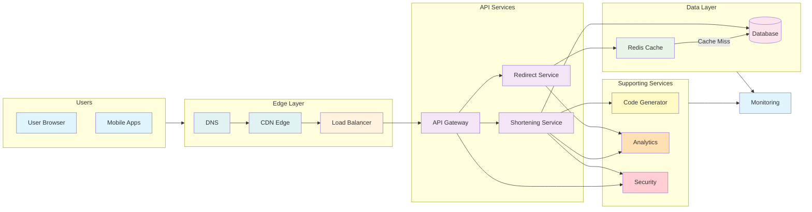

# URL Shortener System Design - Two‑Page Summary
## 1. Core Principles
- **Uniqueness** - each short code must map to exactly one long URL. 
- **Low Latency** - redirects must complete in a few milliseconds. 
- **Persistence & Durability** - mappings must survive failures for years.
- **Scalability** - billions of reads/writes; horizontal scaling required. 
- **Security & Trust** - block malicious URLs, prevent abuse.
- **Extensibility** - support analytics, custom domains, expiration, etc.

## 2. High‑Level Architecture

## 6. Storage Layer
**Requirements** Fast reads/writes.Durability.High availability.Billions of rows.Efficient indexing

### Options
- **SQL** - simple, consistent, but harder to scale horizontally.
- **NoSQL** - Cassandra, DynamoDB, MongoDB; highly scalable.
- **Hybrid** - SQL for writes, NoSQL/cache for reads.

### Techniques
- Primary key = short code → O(1) lookups. Sharding by code prefix. Cold storage for inactive links. WAL, snapshots, multi‑region replication.

## 7. Caching Strategies
- **In‑Memory Cache** (Redis/Memcached) for hot URLs.
- **Application Cache** for ultra‑hot keys.
- **CDN Edge Caching** for global traffic.

### Eviction Policies 
LRU, LFU, TTL‑based.
### Challenges
Cache invalidation.Hot key overload → use consistent hashing

## 8. Scalability Challenges
- **Short Code Generation at Scale** - Avoid centralized bottlenecks; use distributed ID generators.
- **Database Scalability** - SQL limits → move to NoSQL or sharded clusters.
- **Caching Infrastructure** - Redis clustering, sharding.
- **Traffic Spikes** - Auto‑scaling redirect servers; pre‑cache viral links.
- **Multi‑Region Scaling** - Geo‑replication, Anycast routing, DNS load balancing.
- **Storage Growth** - Partitioning, cold storage, TTL for expired links.

## 9. Fault Tolerance & Reliability
- Replication across regions. Cache cluster failover. Load balancing across redirect servers. Graceful degradation (redirects still work even if analytics fail). Disaster recovery: snapshots, backups, hot standbys.

## 10. API & Service Design
### Essential Endpoints
- `POST /shorten` - create short link. 
- `GET /{shortCode}` - redirect. 
- `GET /stats/{shortCode}` - analytics. 
- `DELETE /{shortCode}` - expire/remove link.

### Principles
- RESTful design.Rate limiting.Authentication for bulk operations.Consistent error handling

### Microservices Split
- Shortening service.Redirect service.Analytics service

## 11. Security Considerations
- Block phishing/malware URLs. CAPTCHA for bot protection. Rate limiting abusive clients. User authentication for custom links. Protect analytics data.

## 12. Analytics & Monitoring
### Analytics
- Click counts.Geo distribution.Device type.Referrer tracking

### System Monitoring
- Latency.Error rates.Traffic spikes.Cache hit ratio
